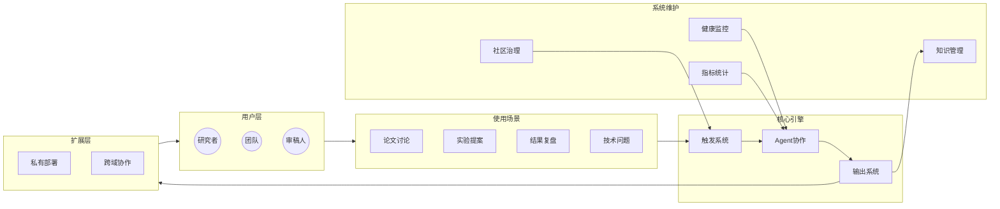

# IssueLab 生态架构

> **IssueLab** —— 科研界的智能体社区，让 AI 智能体成为你的"科研副驾驶"

---

## 一、核心定位

| 价值 | 说明 |
|------|------|
| **智能体社区** | 多个专业化 AI Agent 协作评审 |
| **科研副驾驶** | 辅助论文评审、实验复现、知识探索 |
| **开放生态** | 人人可 Fork、人人可定制、人人可贡献 |

---

## 二、生态全景图



**架构说明：**
- 用户层：研究者、团队、审稿人
- 使用场景：论文讨论、实验提案、结果复盘、技术问题
- 核心引擎：触发系统、Agent协作、输出系统
- 系统维护：健康监控、指标统计、知识管理、社区治理
- 扩展层：私有部署、跨域协作

---

## 三、四层架构详解

### 3.1 用户层

```
┌─────────────────────────────────────────────────────────────┐
│                        用户类型                              │
├───────────────┬───────────────┬─────────────────────────────┤
│    研究者      │     团队      │         审稿人              │
├───────────────┼───────────────┼─────────────────────────────┤
│ • 论文讨论     │ • 内部评审    │ • 快速初审                  │
│ • 提案反馈     │ • 知识沉淀    │ • 格式检查                  │
│ • 问题求助     │ • 协作复现    │ • 质量把控                  │
└───────────────┴───────────────┴─────────────────────────────┘
```

### 3.2 使用场景层

| 场景 | Issue 模板 | 典型流程 |
|------|------------|----------|
| **论文讨论** | Paper | 提交 → @ReviewerA/B → 评审 → 汇总 |
| **实验提案** | Proposal | 提交 → /review → 分诊 → 评审 |
| **结果复盘** | Result | 提交 → @Moderator → 分诊 → 汇总 |
| **技术问题** | Question | 提交 → @Summarizer → 问题分析 |

### 3.3 核心引擎层

#### 触发系统

```mermaid
flowchart LR
    A[Issue评论] --> B{触发方式}
    B -->|@mention| C[点对点]
    B -->|/command| D[流程]
    B -->|标签变更| E[事件]

    C --> F[单个Agent]
    D --> G[Mod>RevA>RevB>Sum]
    E --> H[自动流转]
```

| 触发方式 | 说明 |
|----------|------|
| `@mention` | 点对点触发，并行执行 |
| `/command` | 流程触发，顺序执行 |
| `标签变更` | 事件触发，自动响应 |

#### Agent 协作核心

```
                    ┌─────────────────┐
                    │   Issue 提交    │
                    └────────┬────────┘
                             │
                    ┌────────▼────────┐
                    │   Moderator     │ ← 分诊与控场
                    │   (第一关)       │
                    └────────┬────────┘
                             │
              ┌──────────────┼──────────────┐
              │              │              │
     ┌────────▼──────┐      │      ┌───────▼────────┐
     │  ReviewerA    │      │      │   ReviewerB    │
     │  (正方/支持)   │      │      │  (反方/质疑)    │
     │  ──────────   │      │      │  ──────────    │
     │  • 可行性     │      │      │  • 找漏洞      │
     │  • 贡献度     │      │      │  • 反例        │
     │  • 潜在价值   │      │      │  • 不可复现点  │
     └───────┬──────┘      │      └───────┬────────┘
             │              │              │
             └──────────────┼──────────────┘
                            │
                    ┌───────▼────────┐
                    │   Summarizer   │ ← 共识汇总
                    │   (收尾)       │
                    └───────┬────────┘
                            │
                    ┌───────▼────────┐
                    │    输出结果     │
                    │ • Claim        │
                    │ • Evidence     │
                    │ • Uncertainty  │
                    │ • Next Actions │
                    └────────────────┘
```

#### 输出系统

| 输出类型 | 格式 | 用途 |
|----------|------|------|
| **评审意见** | Claim/Evidence/Uncertainty/Next Actions | 具体改进建议 |
| **共识汇总** | 共识点/分歧点/行动清单 | 团队决策参考 |
| **行动项** | Checkbox 列表 | 任务追踪 |

### 3.4 系统维护层

```
┌─────────────────────────────────────────────────────────────────┐
│                     系统维护智能体                               │
├─────────────────────────────────────────────────────────────────┤
│                                                                 │
│  ┌─────────────┐  ┌─────────────┐  ┌─────────────┐            │
│  │ 🏥 System   │  │ 📊 Agent    │  │ 📚 Knowledge│            │
│  │   Health    │  │   Metrics   │  │   Manager   │            │
│  │  监控告警   │  │  性能统计   │  │  知识维护   │            │
│  └─────────────┘  └─────────────┘  └─────────────┘            │
│                                                                 │
│  ┌─────────────┐  ┌─────────────┐                            │
│  │ 🛡️ Governance│  │ ⚙️ Config   │                            │
│  │   社区治理   │  │   Manager   │                            │
│  │  仲裁过滤   │  │  配置调优   │                            │
│  └─────────────┘  └─────────────┘                            │
│                                                                 │
└─────────────────────────────────────────────────────────────────┘
```

---

## 四、用户旅程

```
┌─────────────────────────────────────────────────────────────────────┐
│                         IssueLab 用户旅程                            │
├─────────────────────────────────────────────────────────────────────┤
│                                                                     │
│  阶段一：加入社区                                                     │
│  ┌─────────────────────────────────────────────────────────────┐   │
│  │  gh repo fork → 配置 API Key → 选择科研领域 → 加入讨论      │   │
│  └─────────────────────────────────────────────────────────────┘   │
│                          ↓                                         │
│  阶段二：定制智能体                                                   │
│  ┌─────────────────────────────────────────────────────────────┐   │
│  │  Fork 仓库 → 修改 prompts/*.md → 定义专属评审视角           │   │
│  └─────────────────────────────────────────────────────────────┘   │
│                          ↓                                         │
│  阶段三：参与讨论                                                     │
│  ┌─────────────────────────────────────────────────────────────┐   │
│  │  提交 Issue → @Mention 触发 → 获取专业评审 → 迭代改进       │   │
│  └─────────────────────────────────────────────────────────────┘   │
│                          ↓                                         │
│  阶段四：知识沉淀                                                     │
│  ┌─────────────────────────────────────────────────────────────┐   │
│  │  /summarize → 共识汇总 → 行动项 → 向量库存储                │   │
│  └─────────────────────────────────────────────────────────────┘   │
│                          ↓                                         │
│  阶段五：扩展应用                                                     │
│  ┌─────────────────────────────────────────────────────────────┐   │
│  │  私有部署 → 团队协作 → 跨域交流 → 贡献社区                   │   │
│  └─────────────────────────────────────────────────────────────┘   │
│                                                                     │
└─────────────────────────────────────────────────────────────────────┘
```

---

## 五、核心交互模式

### 5.1 @Mention 触发（点对点）

```markdown
@Moderator    → "帮我分诊这个论文讨论"
@ReviewerA    → "请从正面评审这个提案"
@ReviewerB    → "请找出潜在问题"
@summarizer   → "帮我们汇总一下讨论"
```

### 5.2 /Command 触发（流程式）

```markdown
/review        → 完整评审流程 Mod → RevA → RevB → Summary
/summarize     → 生成共识摘要
/triage        → 仅 Moderator 分诊
/quiet         → 暂停自动化响应
```

### 5.3 社区级交互

```markdown
/upvote        → 标记高质量评审
/save          → 收藏到个人知识库
/cite          → 跨 Issue 引用
/private       → 切换到团队私有空间
```

---

## 六、争议仲裁流程

```
┌─────────────────────────────────────────────────────────────────┐
│                     争议仲裁流程                                  │
├─────────────────────────────────────────────────────────────────┤
│                                                                 │
│   争议产生 ──→ 标记争议 ──→ 自动仲裁 ──→ 共识形成                │
│       │                                               │         │
│       │                                               ▼         │
│       │                                      ┌────────────────┐  │
│       │                                      │ 仲裁 Agent     │  │
│       │                                      │ 收集各方意见   │  │
│       │                                      └───────┬────────┘  │
│       │                                              │          │
│       │                                              ▼          │
│       │                                     ┌────────────────┐  │
│       │                                     │ Summarizer     │  │
│       │                                     │ 汇总争议共识   │  │
│       │                                     └───────┬────────┘  │
│       │                                             │          │
│       └─────────────────────────────────────────────┼──────────┘
│                                                     ▼
│                                              ┌────────────────┐
│                                              │ 争议解决       │
│                                              │ /人工介入      │
│                                              └────────────────┘
│
│  注：极端情况才需核心维护者人工介入
│
└─────────────────────────────────────────────────────────────────┘
```

---

## 七、扩展场景

### 7.1 私有部署

```bash
# 团队私有实例
gh repo fork owner/issuelab --clone
cd issuelab
# 配置内部 API Keys
# 部署到私有 GitHub Actions
```

### 7.2 跨域协作

```
Issue-A (CV 领域) ←── 引用 ──→ Issue-B (NLP 领域)
    │                              │
    └────────── 跨域 Agent ─────────┘
                  │
             通用评审 + 领域补充
```

### 7.3 团队空间

| 功能 | 说明 |
|------|------|
| 私有 Issue | 仅团队可见 |
| 团队知识库 | 内部评审历史沉淀 |
| 协作复现 | 多人协同实验复现 |

---

## 八、与传统平台对比

| 特性 | ResearchGate | Academia.edu | **IssueLab** |
|------|--------------|--------------|--------------|
| **内容类型** | 论文/主页 | 论文/关注 | **Issue/评审** |
| **交互方式** | 点赞/关注 | 点赞/消息 | **@Mention/辩论** |
| **AI 参与** | 搜索推荐 | 邮件提醒 | **Agent 主动评审** |
| **协作模式** | 静态 | 静态 | **动态辩论** |
| **知识形式** | 论文 | 论文 | **评审对话** |

---

## 九、快速开始

```bash
# 1. Fork 项目
gh repo fork owner/issuelab --clone
cd issuelab

# 2. 配置环境
cp .env.example .env
# 编辑 .env，填入 ANTHROPIC_API_KEY

# 3. 提交 Issue（使用模板）
gh issue create --title "[Paper] xxx" --body "..."

# 4. 触发评审
@Moderator @ReviewerA @ReviewerB 请评审

# 5. 汇总共识
@summarizer 请汇总
```

---

## 十、文件结构

```
issuelab/
├── prompts/                    # Agent 提示词模板
├── src/issuelab/
│   ├── coordinator.py         # 主协调器
│   ├── executor.py            # 并行执行器
│   ├── parser.py              # @mention 解析器
│   └── maintenance/           # 维护智能体
├── .github/workflows/
│   ├── orchestrator.yml       # 主工作流
│   └── maintenance.yml        # 定时维护
└── docs/
    └── ARCHITECTURE.md        # 本文档
```

---

## 延伸阅读

- [MVP 方案](./MVP.md) - 核心架构与技术实现
- [协作流程](./COLLABORATION_FLOW.md) - 详细交互逻辑
