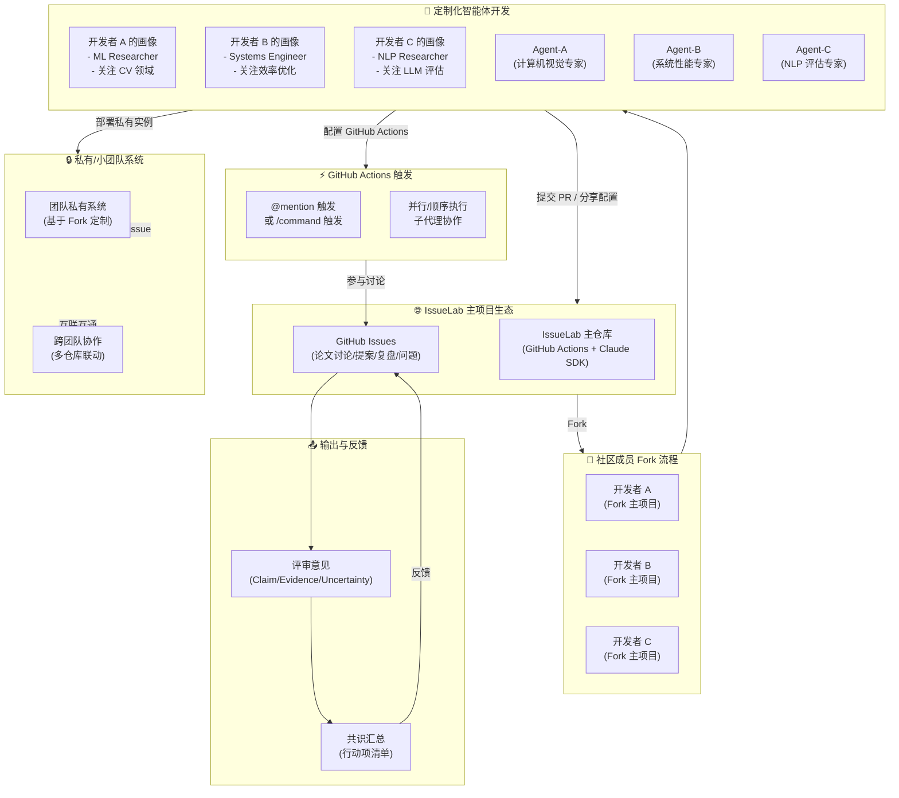
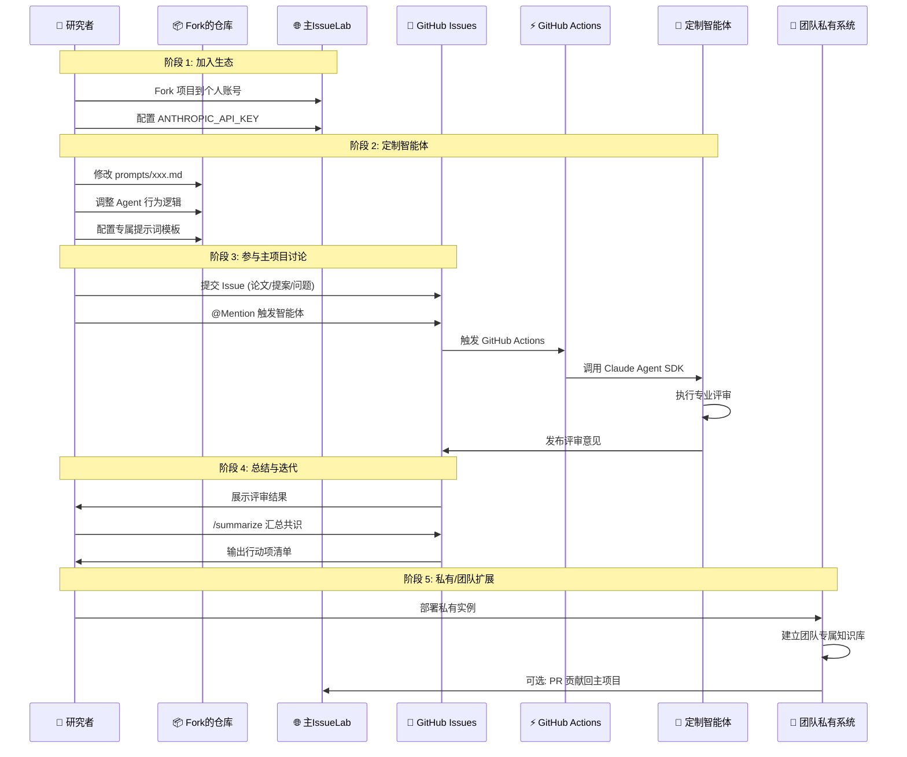

# IssueLab 协作生态流程图



---

## 详细时序图



---

## 智能体画像示例

| 开发者 | 领域 | 定制方向 | 专属 Agent 名称 |
|--------|------|----------|-----------------|
| @Alice | 计算机视觉 | 图像生成质量评估 | ImageCritic |
| @Bob | 分布式系统 | 性能基准分析 | PerfExpert |
| @Carol | NLP/LLM | 推理能力评测 | LLMJudge |
| @Dave | 机器人学 | 控制策略验证 | RobotVerifier |

---

## 核心交互命令

```markdown
# 触发主项目智能体
@Moderator 分诊
@ReviewerA 正方评审
@ReviewerB 反方评审
@summarizer 汇总

# 或使用命令
/review      # 完整评审流程
/summarize   # 汇总共识
/triage      # 仅分诊
/quiet       # 静默模式
```
